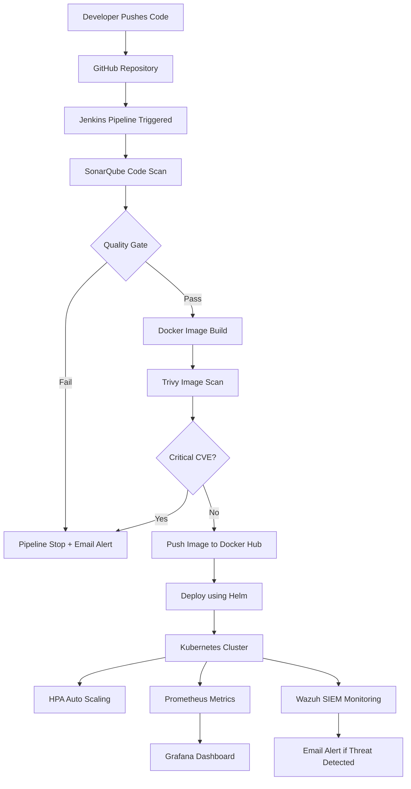

 

  

---

# 📌 Table of Contents

| # | Section |
|---|---------|
| 1 | [🧠 Project Overview](#-project-overview) |
| 2 | [⚠️ Problem Statement](#️-problem-statement) |
| 3 | [🏗️ On-Premises Architecture](#️-on-premises-architecture) |
| 4 | [☁️ AWS Cloud Architecture](#️-aws-cloud-architecture) |
| 5 | [🔄 Complete Pipeline Flow](#-complete-pipeline-flow) |
| 6 | [🛠️ Full Tech Stack](#️-full-tech-stack) |
| 7 | [🧪 Testing & Results](#-testing--results) |
| 8 | [📊 Performance Comparison](#-performance-comparison) |
| 9 | [🚀 Future Enhancements](#-future-enhancements) |
| 10 | [👨‍💻 Author](#-author) |

---

# 🧠 Project Overview

**AUTOSECOPS** is a Final Year Project that implements a complete **DevSecOps automation pipeline**.  
It integrates security, automation, monitoring, containerization, cloud deployment, and real-time threat detection into one practical system.

| 🖥️ On-Premises Deployment | ☁️ AWS Cloud Deployment |
|---|---|
| Local infrastructure with Jenkins, Docker, Kubernetes, Helm, Prometheus, Grafana, Wazuh, and Honeypot | Cloud deployment using AWS EC2, VPC, IAM, CloudTrail, Docker, Jenkins, and Ansible |
| Full control over local infrastructure | Cloud-based scalability and auditability |
| Best for university/local lab environment | Best for real-world cloud deployment |

> **Main Goal:** Automate everything, secure every stage, and monitor the system in real time.

---

# ⚠️ Problem Statement

Traditional software deployment has many problems:

| Problem | Impact |
|---|---|
| 🐢 Slow release cycle | Manual deployment wastes time |
| 🔓 Late security checks | Vulnerabilities are found after deployment |
| 📉 No observability | Teams cannot see real-time system health |
| ⚙️ Manual infrastructure | High chance of human error |
| 🚨 Weak alerting | Threats are noticed late |

**AUTOSECOPS solves this** by adding security checks directly into the CI/CD pipeline.

---

# 🏗️ On-Premises Architecture

## 🔵 Local DevSecOps Pipeline

<table>
<tr>
<td align="center" width="160">
 
<b>GitHub</b> 
Source Code
</td>
<td align="center">➡️</td>
<td align="center" width="160">
 
<b>Jenkins</b> 
CI/CD Pipeline
</td>
<td align="center">➡️</td>
<td align="center" width="160">
 
<b>SonarQube</b> 
SAST Scan
</td>
<td align="center">➡️</td>
<td align="center" width="160">
 
<b>Docker</b> 
Build Image
</td>
</tr>
</table>

 

<table>
<tr>
<td align="center" width="160">
 
<b>Trivy</b> 
CVE Scanner
</td>
<td align="center">➡️</td>
<td align="center" width="160">
 
<b>Kubernetes</b> 
Orchestration
</td>
<td align="center">➡️</td>
<td align="center" width="160">
 
<b>Helm</b> 
K8s Deploy
</td>
<td align="center">➡️</td>
<td align="center" width="160">
 
<b>HPA</b> 
Auto Scaling
</td>
</tr>
</table>

 

<table>
<tr>
<td align="center" width="160">
 
<b>Prometheus</b> 
Metrics
</td>
<td align="center">➡️</td>
<td align="center" width="160">
 
<b>Grafana</b> 
Dashboard
</td>
<td align="center">➡️</td>
<td align="center" width="160">
 
<b>Wazuh SIEM</b> 
Threat Detection
</td>
<td align="center">➡️</td>
<td align="center" width="160">
 
<b>Email Alerts</b> 
Notifications
</td>
</tr>
</table>

---

# ☁️ AWS Cloud Architecture

## 🟠 Cloud DevSecOps Pipeline

<table>
<tr>
<td align="center" width="160">
 
<b>GitHub</b> 
Source Code
</td>
<td align="center">➡️</td>
<td align="center" width="160">
 
<b>Jenkins</b> 
Pipeline
</td>
<td align="center">➡️</td>
<td align="center" width="160">
 
<b>Docker</b> 
Container Build
</td>
<td align="center">➡️</td>
<td align="center" width="160">
 
<b>Ansible</b> 
Automation
</td>
</tr>
</table>

 

<table>
<tr>
<td align="center" width="160">
 
<b>AWS EC2</b> 
Cloud Server
</td>
<td align="center">➡️</td>
<td align="center" width="160">
 
<b>VPC</b> 
Network
</td>
<td align="center">➡️</td>
<td align="center" width="160">
 
<b>IAM</b> 
Access Control
</td>
<td align="center">➡️</td>
<td align="center" width="160">
 
<b>CloudTrail</b> 
Audit Logs
</td>
</tr>
</table>

---

# 🔄 Complete Pipeline Flow

---

# 🛠️ Full Tech Stack

| Category | Tools |
|---|---|
| Source Control | GitHub |
| CI/CD | Jenkins |
| Code Security | SonarQube |
| Containerization | Docker |
| Image Security | Trivy |
| Registry | Docker Hub |
| Orchestration | Kubernetes |
| Package Manager | Helm |
| Scaling | HPA |
| Monitoring | Prometheus |
| Dashboard | Grafana |
| SIEM | Wazuh |
| Cloud | AWS EC2 |
| Automation | Ansible |
| Audit | CloudTrail |
| Access Control | IAM |
| Alerts | Email SMTP |

---

# 🧪 Testing & Results

| Test Case | Tool | Expected Result | Status |
|---|---|---|---|
| Code pushed to GitHub | Jenkins | Pipeline triggered | ✅ Passed |
| Code quality scan | SonarQube | Issues detected | ✅ Passed |
| Docker image scan | Trivy | CVEs detected | ✅ Passed |
| Secure image build | Docker | Image created | ✅ Passed |
| Kubernetes deployment | Helm + K8s | Pods running | ✅ Passed |
| Auto scaling | HPA | Pods scaled | ✅ Passed |
| Monitoring | Prometheus + Grafana | Metrics visible | ✅ Passed |
| Threat detection | Wazuh | Alerts generated | ✅ Passed |
| Email notification | SMTP | Alert received | ✅ Passed |

---

# 📊 Performance Comparison

| Feature | Traditional Method | AUTOSECOPS |
|---|---|---|
| Deployment | Manual | Automated |
| Security | After deployment | During pipeline |
| Speed | Slow | Fast |
| Monitoring | Manual logs | Real-time dashboard |
| Scaling | Manual | HPA automatic |
| Alerts | Delayed | Instant email |
| Audit | Limited | Wazuh + CloudTrail |

---

# 🚀 Future Enhancements

| Enhancement | Purpose |
|---|---|
| AI-Powered SIEM | Smart threat detection |
| ArgoCD GitOps | Advanced Kubernetes deployment |
| OPA Policy Engine | Policy-based security |
| OWASP ZAP | DAST security scanning |
| Multi-Cloud Support | AWS + Azure + GCP |
| Compliance Dashboard | ISO/NIST style reporting |
| Blockchain Logging | Tamper-proof logs |

---

# 👨‍💻 Author

## Muhammad Ali Raza

**Final Year Student — NCBA&E**  
**Specialization:** DevSecOps, Cybersecurity, Cloud Security  

> “Security is not a product, but a process — automate it.”

 

---

**© 2025 Muhammad Ali Raza · AUTOSECOPS · NCBA&E**

