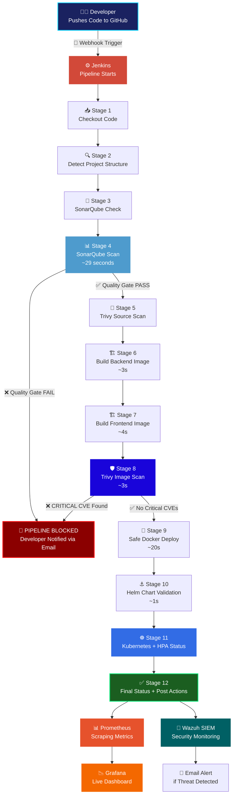
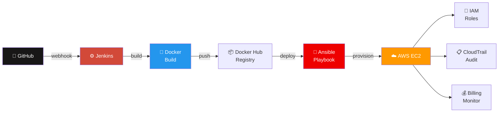

<div align="center">


<br/>

<p>


</p>

<p>


</p>

<p>


</p>

<p>


</p>

<br/>

<a href="https://git.io/typing-svg">

</a>

<br/><br/>

<table>
<tr>
<td align="center">

<br/><b>2223095</b>
</td>
<td align="center">

<br/><b>BS Computer Science</b>
</td>
<td align="center">

<br/><b>Fall Session</b>
</td>
<td align="center">

<br/><b>Pipeline Speed</b>
</td>
</tr>
</table>

<br/>

[](https://github.com/MuhammadAliRaza-DevSecOps/shopcart-pro)
[](https://github.com/MuhammadAliRaza-DevSecOps/shopcart-pro/stargazers)
[](https://github.com/MuhammadAliRaza-DevSecOps/shopcart-pro/forks)

</div>

---

<div align="center">

## 🗂️ Table of Contents

</div>

| # | Section |
|---|---------|
| 1 | [💡 The Story Behind AUTOSECOPS](#-the-story-behind-autosecops) |
| 2 | [🚨 Problem We Solved](#-problem-we-solved) |
| 3 | [🏗️ System Architecture](#️-system-architecture) |
| 4 | [🔄 Complete Pipeline Flow](#-complete-pipeline-flow) |
| 5 | [🛠️ Full Tech Stack with Icons](#️-full-tech-stack-with-icons) |
| 6 | [💻 On-Premises — Shopcart Pro](#-on-premises--shopcart-pro) |
| 7 | [☁️ Cloud Deployment — AWS](#️-cloud-deployment--aws) |
| 8 | [📸 All Screenshots](#-all-screenshots) |
| 9 | [🧪 Testing and Results](#-testing-and-results) |
| 10 | [⚡ Performance Comparison](#-performance-comparison) |
| 11 | [🚀 Getting Started](#-getting-started) |
| 12 | [🔮 Future Enhancements](#-future-enhancements) |

---

## 💡 The Story Behind AUTOSECOPS

You know that feeling when you deploy code and just **pray** nothing breaks? Or worse — security finds a vulnerability *after* it's already live in production?

That's exactly what **AUTOSECOPS** was built to fix.

The moment a developer types `git push` — an entire automated security machine wakes up. It scans the code, checks quality, builds a Docker image, scans *that* for CVEs, deploys to Kubernetes, and starts monitoring — **all without a single human clicking anything.**

> 💬 *"Security is not a phase you do at the end. It's a habit you build into every single step."*

Built entirely with **free, open-source tools** — proving enterprise-grade DevSecOps doesn't need a million-dollar budget.

---

## 🚨 Problem We Solved
╔══════════════════════════════════╗    ╔══════════════════════════════════╗
║      ❌ BEFORE AUTOSECOPS        ║    ║      ✅ AFTER AUTOSECOPS         ║
╠══════════════════════════════════╣    ╠══════════════════════════════════╣
║ Developer pushes code            ║    ║ Developer pushes code            ║
║          ↓                       ║    ║          ↓                       ║
║ (Manual) Someone runs tests      ║    ║ Jenkins triggers AUTOMATICALLY   ║
║          ↓                       ║    ║          ↓                       ║
║ (Days later) Security audit      ║    ║ SonarQube scans code INSTANTLY   ║
║          ↓                       ║    ║          ↓                       ║
║ (Maybe) Fix vulnerabilities      ║    ║ Docker built + Trivy scans it    ║
║          ↓                       ║    ║          ↓                       ║
║ (Manual) Ops team deploys        ║    ║ Helm deploys to Kubernetes       ║
║          ↓                       ║    ║          ↓                       ║
║ Hope nothing breaks...           ║    ║ Prometheus + Grafana monitor     ║
║          ↓                       ║    ║          ↓                       ║
║ Check logs manually tomorrow     ║    ║ Wazuh alerts on any threat       ║
║                                  ║    ║          ↓                       ║
║ ⏰ Hours to days                 ║    ║ 📧 Email Alert instantly         ║
║ 🔓 Vulns reach production        ║    ║ ⚡ ~2 minutes automated          ║
║ 😰 Human error everywhere        ║    ║ 🔐 Blocked at every gate         ║
╚══════════════════════════════════╝    ╚══════════════════════════════════╝

---

## 🏗️ System Architecture

### 🖥️ On-Premises Architecture
╔══════════════════════════════════════════════════════════════════════╗
║                 🛡️  AUTOSECOPS — ON PREMISES                        ║
╠══════════════════════════════════════════════════════════════════════╣
║                                                                      ║
║   👨‍💻 Developer                                                        ║
║        │  git push                                                   ║
║        ▼                                                             ║
║   ┌─────────────┐   🔔 webhook   ┌──────────────────────────────┐   ║
║   │  🐙 GitHub  │───────────────▶│      ⚙️  JENKINS             │   ║
║   │  Repository │               │   CI/CD Pipeline Engine       │   ║
║   └─────────────┘               └──────────────┬───────────────┘   ║
║                                                 │                   ║
║              ┌──────────────────────────────────┤                   ║
║              │                                  │                   ║
║              ▼                                  ▼                   ║
║   ┌──────────────────┐               ┌──────────────────┐          ║
║   │  🔬 SonarQube    │               │  🐳 Docker Build  │          ║
║   │  SAST Scanning   │               │  (Multi-stage)    │          ║
║   │  Quality Gate    │               └────────┬─────────┘          ║
║   └────────┬─────────┘                        │                    ║
║            │ ✅ PASS                           ▼                    ║
║            │                        ┌──────────────────┐           ║
║            │                        │  🛡️ Trivy Scan   │           ║
║            │                        │  CVE Detection    │           ║
║            │                        └────────┬─────────┘           ║
║            │                                 │ ✅ PASS              ║
║            └─────────────────────────────────┘                     ║
║                                              │                     ║
║                                              ▼                     ║
║                    ┌─────────────────────────────────────┐         ║
║                    │      ☸️  KUBERNETES CLUSTER          │         ║
║                    │  ┌──────┐  ┌──────┐  ┌──────┐       │         ║
║                    │  │ Pod  │  │ Pod  │  │ Pod  │  📈HPA│         ║
║                    │  └──────┘  └──────┘  └──────┘       │         ║
║                    │       ⚓ Helm Charts Deployed         │         ║
║                    └────────────────┬────────────────────┘         ║
║                                     │                              ║
║              ┌──────────────────────┼──────────────┐               ║
║              ▼                      ▼              ▼               ║
║   ┌─────────────────┐    ┌──────────────┐  ┌────────────┐         ║
║   │  📊 Prometheus  │    │ 📉 Grafana   │  │ 🔐 Wazuh  │         ║
║   │ Metrics Scraper │───▶│  Dashboard   │  │ SIEM/HIDS  │         ║
║   └─────────────────┘    └──────────────┘  └─────┬──────┘         ║
║                                                   │                ║
║                                                   ▼                ║
║                                        📧 Email Alerts             ║
║                                        🍯 Honeypot Active          ║
╚══════════════════════════════════════════════════════════════════════╝

### ☁️ Cloud Architecture — AWS
╔══════════════════════════════════════════════════════════════════════╗
║                  ☁️  AUTOSECOPS — AWS CLOUD                         ║
╠══════════════════════════════════════════════════════════════════════╣
║                                                                      ║
║  🐙 GitHub → ⚙️ Jenkins → 🐳 Docker → 📜 Ansible → ☁️ AWS EC2      ║
║                                                                      ║
║  ┌────────────────────── 🌐 VPC ──────────────────────────────┐     ║
║  │                                                            │     ║
║  │   ┌──────────────────────────────────────────────────┐    │     ║
║  │   │               💻 EC2 Instance                    │    │     ║
║  │   │  ┌──────────┐  ┌──────────┐  ┌───────────────┐  │    │     ║
║  │   │  │⚛️Frontend│  │🟢Backend │  │🍃  MongoDB    │  │    │     ║
║  │   │  │  :3000   │  │  :5000   │  │   :27017      │  │    │     ║
║  │   │  └──────────┘  └──────────┘  └───────────────┘  │    │     ║
║  │   │         🐳 Docker Compose Managed                │    │     ║
║  │   └──────────────────────────────────────────────────┘    │     ║
║  │                                                            │     ║
║  │   🔒 Security Groups: 22 | 3000 | 5000 | 8081             │     ║
║  └────────────────────────────────────────────────────────────┘     ║
║                                                                      ║
║   👤 IAM Least Privilege    📋 CloudTrail Audit    💰 Billing Alert ║
╚══════════════════════════════════════════════════════════════════════╝

---

## 🔄 Complete Pipeline Flow



### ☁️ Cloud Pipeline



---

## 🛠️ Full Tech Stack with Icons

### 🖥️ On-Premises Pipeline

| Icon | Tool | Role | Why Chosen |
|------|------|------|------------|
|  | **GitHub** | Source Control | Webhook-based auto pipeline trigger |
|  | **Jenkins** | CI/CD Engine | Self-hosted, 1800+ plugins, on-prem perfect |
|  | **SonarQube** | SAST Scanner | Catches bugs and vulns before Docker build |
|  | **Docker** | Containerization | Consistent environments, multi-stage builds |
|  | **Trivy** | CVE Scanner | Scans OS packages + dependencies in images |
|  | **Kubernetes** | Orchestration | Self-healing, auto-scaling, production-grade |
|  | **Helm** | Package Manager | Templated K8s deployments, version history |
| ⚖️ | **HPA** | Auto Scaling | CPU-based pod scaling — min 2, max 10 |
|  | **Prometheus** | Metrics | Scrapes all pod metrics every 15 seconds |
|  | **Grafana** | Dashboards | Real-time visual monitoring |
| 🔐 | **Wazuh** | SIEM + HIDS | File integrity + log correlation + intrusion |
| 📧 | **Email SMTP** | Alerts | Instant notification on security events |
| 🍯 | **Honeypot** | Deception | Detect and log malicious requests |

### ☁️ Cloud Tools

| Icon | Tool | Purpose |
|------|------|---------|
|  | **AWS EC2** | Virtual server for production deployment |
| 🌐 | **AWS VPC** | Isolated network with subnets and routing |
|  | **Ansible** | Agentless EC2 provisioning and deployment |
| 👤 | **IAM** | Least privilege roles — no root account |
| 📋 | **CloudTrail** | Every API call logged for compliance |
| 💰 | **AWS Billing Alerts** | Budget threshold notifications |

---

## 💻 On-Premises — Shopcart Pro

Shopcart Pro is a full-stack e-commerce web application — the **real-world target** of our DevSecOps pipeline:
╔═══════════════════════════════════════════╗
║           🛒  SHOPCART PRO                ║
╠═══════════════════════════════════════════╣
║  ⚛️  Frontend   │  React.js  │  Port 3000 ║
║  🟢  Backend    │  Node.js   │  Port 5000 ║
║  🍃  Database   │  MongoDB   │  Port 27017║
║  🔧  Admin DB   │  Mongo Exp │  Port 8081 ║
╠═══════════════════════════════════════════╣
║   Each service = its own Docker container ║
╚═══════════════════════════════════════════╝

> Every time code changes in the GitHub repo → entire pipeline runs → secure deployment happens. **Nobody clicks anything.** That's the whole point.

---

## ☁️ Cloud Deployment — AWS

The **same Shopcart application**, taken to the cloud using AWS EC2, Docker Compose, and Ansible — proving the pipeline is **environment-agnostic**.

**Key cloud security features implemented:**
🔒 SSH key-pair auth       — no password login ever
🛡️ Security Groups         — only required ports open
👤 IAM least privilege     — no root account in production
📋 CloudTrail logging      — full API audit trail
💰 Budget alerts           — billing governance active

---

## 📸 All Screenshots

---

### 🖥️ On-Premises Screenshots

---

#### 📌 Figure 4.1 — Shopcart Source Code on GitHub
> Every commit automatically fires the Jenkins pipeline via webhook — zero manual trigger


---

#### 📌 Figure 4.1.2 — ShopcartPro Running Live in Browser
> Application live and accessible — the final goal of every single pipeline run


---

#### 📌 Figure 4.2.1 — Jenkins Pipeline — ALL 12 Stages Green ✅
> Average run time ~2 minutes 16 seconds — fully automated, zero manual steps


---

#### 📌 Figure 4.2.2 — Jenkins + Related Containers in Docker
> Jenkins runs in Docker alongside all its service containers


---

#### 📌 Figure 4.3.1 — SonarQube Code Quality and Security Scan
> Bugs: 0 ✅ | Vulnerabilities: 0 ✅ | Code Smells: 103 — A Grade on security metrics


---

#### 📌 Figure 4.3.2 — Trivy Docker Image Vulnerability Scan
> Trivy listing all CVEs found in the image — pipeline automatically blocks on HIGH/CRITICAL


---

#### 📌 Figure 4.4.1 — Shopcart Containers Running with Port Mappings
> All four containers active with correct port mappings confirmed


---

#### 📌 Figure 4.4.2 — Docker Desktop View of All Active Containers
> All Shopcart containers visible and healthy in Docker Desktop


---

#### 📌 Figure 4.5.1 — Kubernetes Pods Running in Namespace
> Pods deployed and running in production namespace — scheduled by Kubernetes


---

#### 📌 Figure 4.5.2 — Helm Release Confirming Successful Deployment
> Helm showing successful release with full version history for easy rollback


---

#### 📌 Figure 4.6 — HPA Actively Scaling Pods Based on CPU Load
> HPA scaling pods from minimum 2 up to 7 during stress test — zero manual intervention


---

#### 📌 Figure 4.7.1 — Grafana Live Monitoring Dashboard
> Real-time CPU, memory, request rate, pod health — all visible at a single glance


---

#### 📌 Figure 4.7.2 — Prometheus Scraping Backend Endpoint
> Prometheus scraping Shopcart backend /metrics endpoint every 15 seconds


---

#### 📌 Figure 4.8 — Wazuh SIEM Showing Active Agents and Alerts
> Wazuh showing active monitoring agents and live security event alerts


---

#### 📌 Figure 4.9 — Honeypot Catching Suspicious Requests
> Custom honeypot endpoint logging malicious actors probing the system


---

#### 📌 Figure 4.10 — Security Alert Email Received
> Real email received after honeypot was triggered — end-to-end alerting proven


---

### ☁️ Cloud / AWS Screenshots

---

#### 📌 Figure 4.11 — EC2 Instance with Keypair and Security Groups
> EC2 with SSH keypair authentication and Security Groups on required ports only


---

#### 📌 Figure 4.12 — SSH Login via Private Key via Git Bash
> Secure SSH connection using private key — password authentication completely disabled


---

#### 📌 Figure 4.13 — Shopcart Containers on EC2 via Docker Compose
> Same containerized app running in AWS cloud — environment portability proven


---

#### 📌 Figure 4.14 — Ansible Ping Confirming EC2 Host Reachable
> Ansible confirming successful connectivity to EC2 before running deployment playbooks


---

#### 📌 Figure 4.15 — Cloud Jenkins Pipeline All Stages Complete
> GitHub to Docker to Ansible to EC2 — every stage green


---

#### 📌 Figure 4.16 — AWS VPC Setup with Subnets and Route Table
> VPC with subnets, route tables, and internet gateway properly configured


---

#### 📌 Figure 4.17 — CloudTrail Logging API Events on EC2
> Every API call logged with timestamp, user identity, and IP — full audit trail


---

#### 📌 Figure 4.18 — AWS Billing Summary
> Monthly cloud cost visible — budget alerts configured to prevent surprises


---

#### 📌 Figure 4.19 — IAM User Group with Restricted Permissions
> Least privilege IAM setup — specific permissions only, no root account in production


---

#### 📌 Figure 4.20 — Shopcart Live on EC2 Public IP
> Shopcart loading in browser via EC2 public IP — cloud deployment fully verified


---

## 🧪 Testing and Results

### ✅ Functional Testing — All 10 Passed

| ID | 🔧 Module | What We Tested | Expected | Actual | Status |
|----|-----------|----------------|----------|--------|--------|
| TC-01 | ⚙️ CI/CD | Git commit triggers Jenkins | Auto trigger | Triggered | ✅ **PASS** |
| TC-02 | ⚙️ Jenkins | All 12 stages complete | All green | All passed | ✅ **PASS** |
| TC-03 | 🔬 SonarQube | Code quality + security scan | Issues reported | Reported | ✅ **PASS** |
| TC-04 | 🛡️ Trivy | Docker image CVE scan | Vulns listed | Detected | ✅ **PASS** |
| TC-05 | 🐳 Docker | Backend + frontend image build | Images created | Created | ✅ **PASS** |
| TC-06 | ☸️ Kubernetes | Pods deployed and managed | Pods running | Running | ✅ **PASS** |
| TC-07 | 📈 HPA | Auto-scaling under CPU load | Pods scaled | Scaled 2→7 | ✅ **PASS** |
| TC-08 | 🌐 Application | App accessible via browser | App loads | Accessible | ✅ **PASS** |
| TC-09 | 🔐 Wazuh SIEM | Failed login detection | Alert generated | Alerted | ✅ **PASS** |
| TC-10 | 📧 Email Alerts | Security email notification | Email received | Received | ✅ **PASS** |

### 🔐 Security Testing — All Passed

| ID | Module | Attack Simulated | Result | Status |
|----|--------|-----------------|--------|--------|
| ST-01 | 🔑 Login System | Brute force repeated wrong passwords | Account locked | ✅ **PASS** |
| ST-02 | 🔐 Wazuh SIEM | Suspicious activity simulation | Alerts generated | ✅ **PASS** |
| ST-03 | 🛡️ Trivy | Known vulnerable packages scan | CVEs detected | ✅ **PASS** |
| ST-04 | 🔬 SonarQube | Insecure code patterns scan | Issues flagged | ✅ **PASS** |

### 📊 Overall Summary

| Test Type | Result |
|-----------|--------|
| ✅ Functional Testing | **Successful** |
| ✅ Integration Testing | **Successful** |
| ✅ Security Testing | **Effective** |
| ✅ Performance Testing | **Stable** |

---

## ⚡ Performance Comparison

| Feature | ❌ Traditional Manual | ✅ AUTOSECOPS |
|---------|----------------------|--------------|
| 🚀 Deployment Speed | Hours of manual steps | **~2 min 16 sec automated** |
| 🔐 Security Checks | Done after deployment | **At every pipeline stage** |
| 📊 Monitoring | Check logs manually | **Real-time Grafana dashboards** |
| 📈 Scalability | Manual — add servers | **Auto — K8s HPA scales pods** |
| 🔔 Alerts | Someone notices issue | **Instant email on anomaly** |
| 📋 Audit Trail | Nothing logged | **CloudTrail + Wazuh + Jenkins** |
| 🔄 Rollback | Manual, risky | **helm rollback — one command** |
| 👤 Human Effort | High — every single step | **Minimal — only exceptions** |
| 💰 Tool Cost | Expensive licensed tools | **$0 — 100% open source** |
| 🔁 Consistency | Different every time | **Identical every single run** |

---

## 🚀 Getting Started

### Prerequisites

```bash
git --version          # Git
docker --version       # Docker Desktop
kubectl version        # Kubernetes CLI
helm version           # Helm 3.x
java -version          # Java 11+
ansible --version      # Ansible
```

### 1️⃣ Clone This Repo

```bash
git clone https://github.com/MuhammadAliRaza-DevSecOps/shopcart-pro.git
cd shopcart-pro
```

### 2️⃣ Start Jenkins

```bash
docker run -d \
  --name jenkins \
  -p 8080:8080 \
  -p 50000:50000 \
  -v jenkins_home:/var/jenkins_home \
  -v /var/run/docker.sock:/var/run/docker.sock \
  jenkins/jenkins:lts

# Get password:
docker exec jenkins cat /var/jenkins_home/secrets/initialAdminPassword
# Open: http://localhost:8080
```

### 3️⃣ Start SonarQube

```bash
docker run -d \
  --name sonarqube \
  -p 9000:9000 \
  sonarqube:community
# Open: http://localhost:9000  (admin / admin)
```

### 4️⃣ Deploy to Kubernetes

```bash
helm install shopcart-pro ./kubernetes/helm-charts/ \
  --namespace production \
  --create-namespace

kubectl get pods -n production
kubectl get hpa  -n production
```

### 5️⃣ Open the App

```bash
kubectl port-forward svc/shopcart-frontend 3000:3000 -n production
# Open: http://localhost:3000
```

### 6️⃣ Monitoring
📊 Prometheus → http://localhost:9090
📉 Grafana    → http://localhost:3001  (admin / prom-operator)

---

## 🔮 Future Enhancements

| Priority | 🔧 Enhancement | What It Adds |
|----------|----------------|--------------|
| 🔴 High | **pfSense Firewall** | Next-gen network perimeter security |
| 🔴 High | **Nessus / OpenVAS** | Network-wide CVE scanning and compliance |
| 🔴 High | **AI/ML Anomaly Detection** | ML-based intelligent threat recognition |
| 🟡 Medium | **Ollama Local LLM** | Self-hosted AI for log analysis |
| 🟡 Medium | **Microsoft Active Directory** | Centralized identity management and SSO |
| 🟡 Medium | **Blockchain Audit Logging** | Immutable tamper-proof audit trail |
| 🟡 Medium | **Multi-Cloud Azure + GCP** | Terraform IaC cloud-agnostic setup |
| 🟢 Low | **Jira Integration** | Auto ticket on pipeline failures |
| 🟢 Low | **SOAR Integration** | Security Orchestration and Response |
| 🟢 Low | **DAST with OWASP ZAP** | Dynamic application security testing |

---

<div align="center">


<br/>

### 👨‍💻 Built by

**Muhammad Ali Raza** | Roll No: 2223095 | NCBA&E 2026

[](https://github.com/MuhammadAliRaza-DevSecOps/shopcart-pro)

<br/>

**⭐ If this project helped you — drop a star, it means everything! ⭐**

<br/>

*Built with ❤️, endless debug sessions, and a lot of chai ☕*

<br/>

**بِسْمِ اللهِ الرَّحْمٰنِ الرَّحِيْمِ**

</div>
